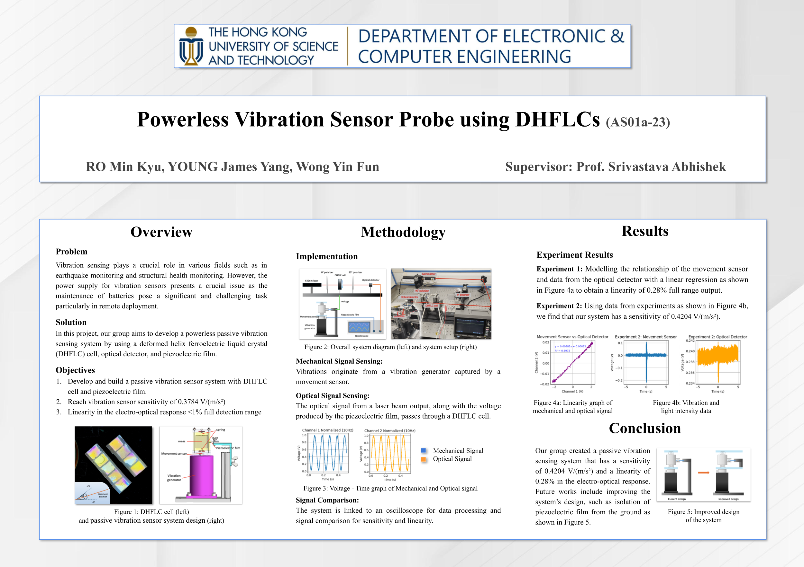
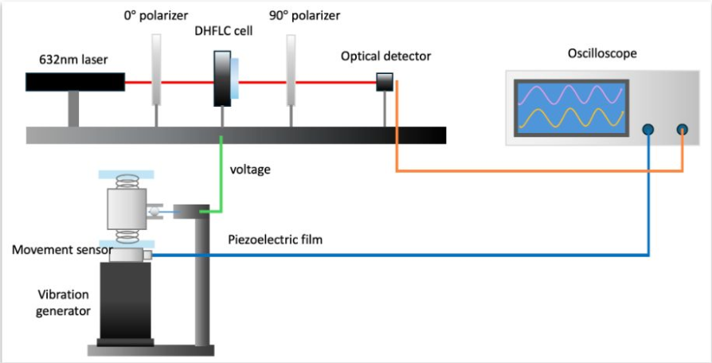
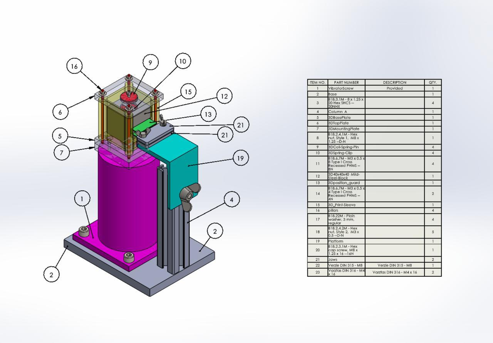
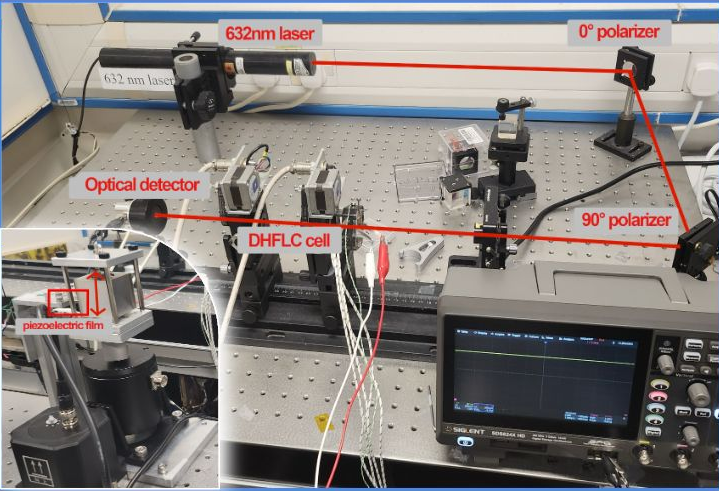

# FYP-Passive-Vibration-System

My final year project (FYP) at HKUST where we built a Powerless Vibration Sensor Probe using DHFLCs. For more detail on the project, the final report is [here](./FYP-Final-Report.pdf).

## Poster

## Project Background

### Problem

Vibration sensing plays a crucial role in various fields such as in  earthquake monitoring and structural health monitoring. However, the power supply for vibration sensors presents a crucial issue as the maintenance of batteries pose a significant and challenging task particularly in remote deployment.

### Solution

Our group aims to develop a powerless passive vibration sensing system by using a deformed helix ferroelectric liquid crystal (DHFLC) cell, optical detector, and piezoelectric film.

### Objectives

1. Develop and build a passive vibration sensor system with DHFLC cell and piezoelectric film.
2. Reach vibration sensor sensitivity of 0.3784 V/(m/s²)
3. Linearity in the electro-optical response <1% full detection range

## System Design

### Overall System Diagram

### Vibration Sensor Device Design

### Lab Setup

## Experimental Results

The raw data used is in [experiment-data](./experiment-data/) folder. The [Jupyter Notebook](./Data_Analysis.ipynb) contains the various graphs and data analysis used.

In the end, our system reached a sensitivity of has a sensitivity of 0.4204 V/(m/s²) and a linearity of 0.28%, reaching our target objectives.

## FYP Results

Our project received 2nd place in the Best Demo Award for HKUST ECE Final Year Project Industry Day (Demo Day). We also received 2nd runner-up in the mid-term poster. 
